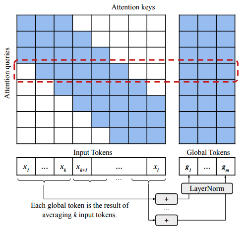
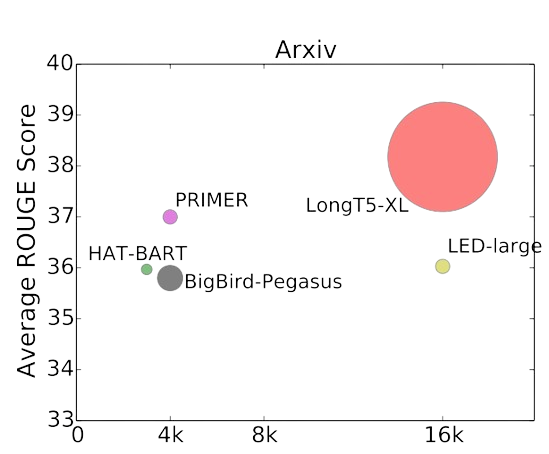
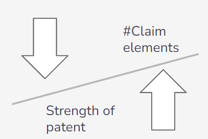
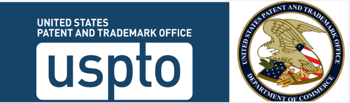
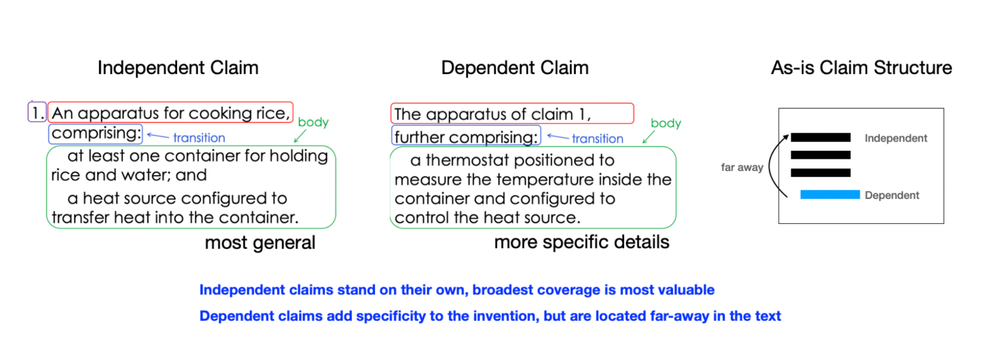
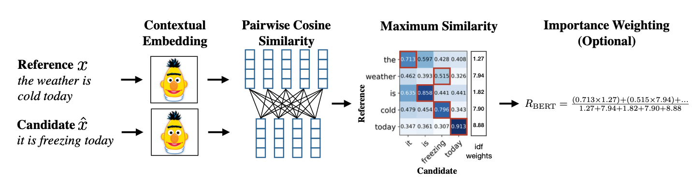
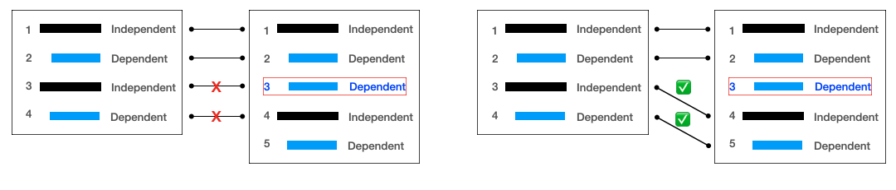
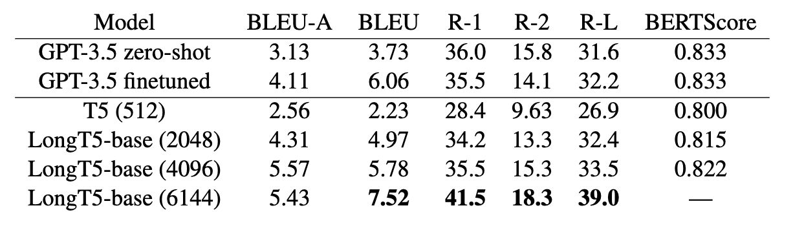

# Patent Claims Generation

## Table of Contents
- [Introduction](#introduction)
- [Motivation](#motivation)
- [Dataset](#dataset)
- [Solution Overview](#solution-overview)
- [Challenges](#challenges)
- [Evaluation Metrics](#evaluation-metrics)
- [Preliminary Results](#preliminary-results)
- [Future Work](#future-work)
- [Contributors](#contributors)

---

## Introduction

Patent claims play a crucial role in defining the scope and boundaries of intellectual property. Traditionally, drafting patent claims is a manual, time-consuming, and error-prone task that requires significant effort from legal experts. Our project aims to automate the generation of patent claims using state-of-the-art language models, which can significantly accelerate the patent application process while reducing costs and improving efficiency.

## Motivation
The manual drafting process for patent claims often leads to delays, errors, and high costs due to the necessity of legal expertise. By automating this process, we aim to:
- Save time and resources.
- Improve the accuracy of claim generation.
- Enable faster patent application processing.

## Dataset

We utilized patent data from the **United States Patent and Trademark Office (USPTO)**, specifically focusing on patents issued from 2005. The dataset was preprocessed to include the following key components:
- Summary of the patent
- Detailed descriptions
- Patent claims  

### Dataset Breakdown:
- **Total Size:** 10,000 patents  
- **Training Set:** 8,000 patents  
- **Validation Set:** 1,000 patents  
- **Test Set:** 1,000 patents  

---

## Solution Overview
### Baseline Models:

- **T5 Transformer:** Token limit of 512 tokens.
- **ChatGPT-3.5:** Zero-shot and fine-tuned evaluation for claim generation.
- **LongT5:** Optimized for long-sequence input (up to 16,000 tokens for extended context retention).

### LongT5 Configuration:

- **Attention Mechanism:** TGlobal attention  
- **Training Context Lengths:**  
  - 16k tokens for datasets like arXiv, PubMed, BigPatent  
  - 8k for MultiNews  
  - 4k for MediaSum and CNN/Daily News  
- **Fine-tuned on:** Our custom patent dataset to accommodate domain-specific language.  

---

## Challenges

1. **Claim Structure:** Maintaining logical structure while generating valid claims.  
2. **Input Length Limitation:**  
   - Colab Pro initially limited input to 2048 tokens.  
   - Upgraded to Colab Pro+ for a limit of 6144 tokens.  
3. **GPU Constraints:**  
   - Colab Pro could not handle LongT5-large and LongT5-xl models due to memory limitations.  

---

## Evaluation Metrics

We used the following metrics to assess the generated claims:
1. **BLEU Score:** Measures precision by checking how many generated n-grams appear in the reference claims, with a brevity penalty for short outputs.
2. **ROUGE Recall:** Assesses recall by evaluating how many n-grams from the reference appear in the generated text.
3. **BERTScore:** Evaluates semantic similarity by comparing sentence embeddings and correlating with human rankings for validation.  

### Sentence Alignment Problem:

- To address sentence order issues in evaluation, we developed a custom **Dynamic Programming (DP) algorithm** inspired by Needleman and Wunsch (used in DNA sequence alignment).  
- Optimized alignment for BLEU scoring using O(MN) complexity.

---

## Preliminary Results

- **Key Finding:** Longer input contexts improve model performance.  
- **Testing:** Evaluated across 3 epochs with a test size of 1,000 samples.  

### Sample Generated Claims:
1. **Example 1:**  
   *A safety device comprising: an elastic sealing element with a sealer and a counter-element…*  

2. **Example 2:**  
   *A safety apparatus to prevent the spread of fire from a fixing chamber, comprising…*  

---

## Future Work

We aim to further improve the model through:
1. Training with additional data to improve generalization.  
2. Expanding input lengths to accommodate longer contexts (8k, 16k tokens).  
3. Experimenting with advanced decoding methods like **top-k sampling** and **nucleus sampling** to minimize repetitive outputs.  

---

## Contributors
- **Ryan Lee**  
- **Ryan Niu**  
- **Rishikesh Sivakumar**  
- **Spurthy Skandan**  
- **Joseph Wang**

---

## Acknowledgments
We appreciate the support and computational resources provided throughout this project. Special thanks to the guidance received during model fine-tuning and evaluation stages.
